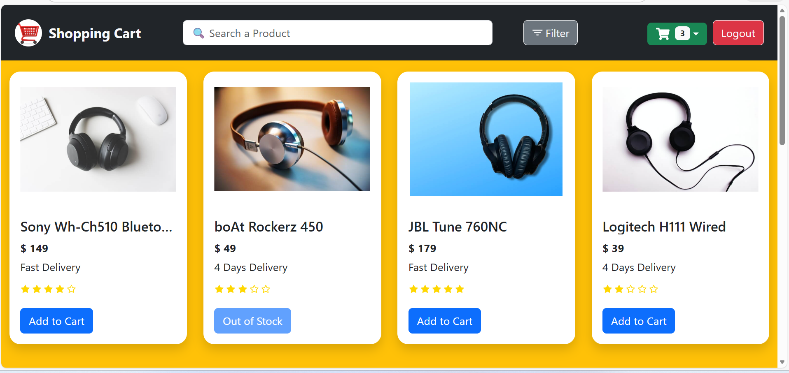
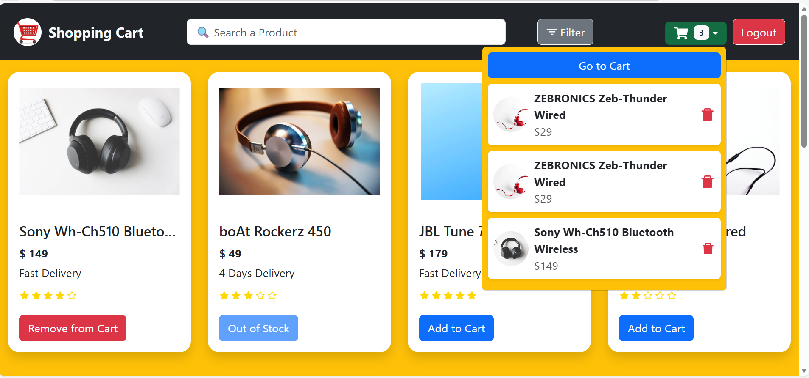
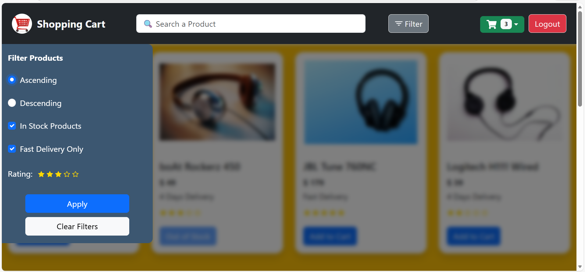
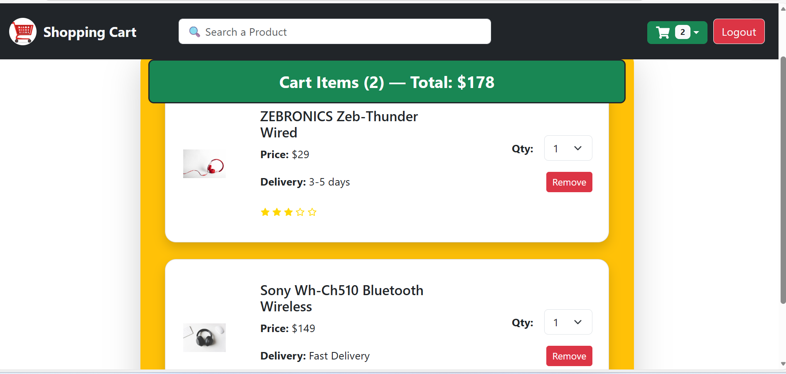

🛒 Shopping Cart App (React + Redux Toolkit)

A fully responsive shopping cart application built using React, Redux Toolkit, and React Bootstrap. Includes authentication (Signup/Login), dynamic filtering, cart management, and a smooth UI with animations and Toastify alerts.

# 🔴 Live Demo
[🚀 View Live Demo](https://react-shopping-cart-using-redux-too.vercel.app/login)

# ⭐ Features

# 🔐 Authentication

  User Signup (name, email, password)
  
  Secure Login using JWT (local simulation)
  
  Protected Routes
  
  Logout with Toast notifications

# 🛍 Product & Cart

  Product listing with search bar
  
  Add/Remove products from cart
  
  Quantity update inside cart
  
  Total price auto-calculation

  Sticky cart header

# 🎯 Filters

  Sort by price (Ascending/Descending)
  
  In-stock filter
  
  Fast delivery filter
  
  Rating filter with interactive stars
  
  Slide-in filter panel with background blur
  
  Apply / Clear filters

📱 Responsive UI

  Mobile-friendly header design
  
  Custom-styled Toastify
  
  Adaptive grid layout
  
  Smooth hover animations

# 🧰 Tech Stack
    Category	              Tools

    Frontend	              React, JSX, CSS
    State Management	      Redux Toolkit
    UI Components	          React Bootstrap
    Routing	                React Router DOM
    Icons	                  React Icons
    Notifications	          React Toastify

## 📂 Folder Structure

    src/
    ├── components/
    │   ├── Filter.jsx
    │   ├── ProductCard.jsx
    │   ├── Rating.jsx
    │   ├── Header/
    │   │   ├── Header.jsx
    │   │   ├── Logo.jsx
    │   │   ├── Dropdown.jsx
    │   │   └── SearchBar.jsx
    │   └── CartCard.jsx
    │
    ├── data/
    │   └── products.js
    │
    ├── features/
    │   └── auth/
    │       ├── AuthService.js
    │       ├── authSlice.js
    │       └── ProtectedRoute.jsx
    │
    ├── hooks/
    │   └── useTitle.jsx
    │
    ├── pages/
    │   ├── Home.jsx
    │   ├── Cart.jsx
    │   ├── Login.jsx
    │   └── Signup.jsx
    │
    ├── router/
    │   └── AllRoutes.jsx
    │
    ├── screenshort/
    │   ├── HomePagewithFilter.png
    │   ├── HomeWithCartList.png
    │   └── CartList.png
    │
    ├── store/
    │   ├── store.js
    │   ├── cartSlice.js
    │   └── filterSlice.js
    │
    ├── App.js
    ├── App.css
    └── index.js

## 📸 Screenshots

### 🏠 Home Page

### 🛒 Home Page with Cart Items

### 🛒 Home Page with Filter

### 📋 Cart Page
