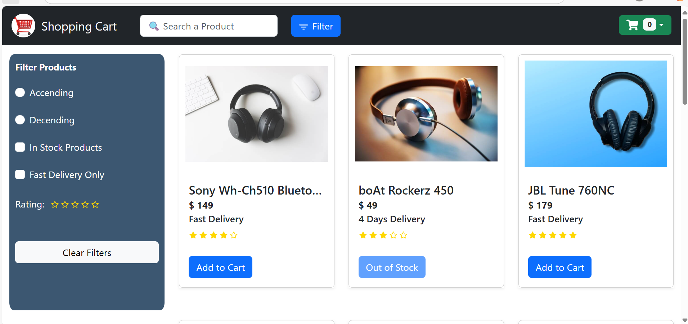
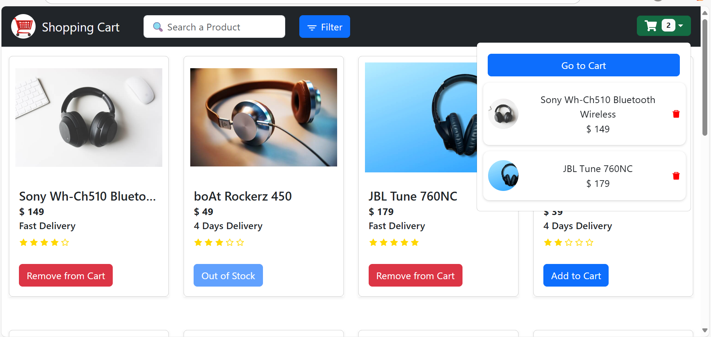

# 🛒 Shopping Cart Redux

A responsive shopping cart application built with **React**, **Redux Toolkit**, and **Bootstrap**. This project demonstrates dynamic product filtering, cart management, and clean state handling using modern React practices.

## 🚀 Features

- 🧾 Product listing with detailed cards
- 📦 Add and remove items from the cart
- 🎯 Filter by:
  - In stock
  - Fast delivery
  - Rating (1 to 5 stars)
- 🔍 Real-time search bar
- ⭐ Interactive rating selector
- ⚛️ State managed with Redux Toolkit
- 🔁 Page navigation with React Router
- 💅 Styled using React Bootstrap and CSS

## 🧰 Tech Stack

- React
- Redux Toolkit
- React Bootstrap
- React Router DOM
- React Icons

## 📂 Folder Structure

src/
├── components/
│ ├── Header/
│ ├── CartCard.jsx
│ ├── Filter.jsx
│ ├── ProductCard.jsx
│ └── Rating.jsx
├── data/
│ └── products.js
├── hooks/
│ └── useTitle.jsx
├── pages/
│ ├── Cart.jsx
│ └── Home.jsx
├── router/
│ └── AllRoutes.jsx
├── screenshots/
│ ├── CartList.png
│ ├── HomePagewithFilter.pgn
│ └── HomeWithCartList.png
├── store/
│ ├── cartSlice.js
│ ├── filterSlice.js
│ └── store.js
├── App.js
└── index.js

## 📸 Screenshots

### 🏠 Home Page with Filters

### 🛒 Home Page with Cart Items

### 📋 Cart Page
